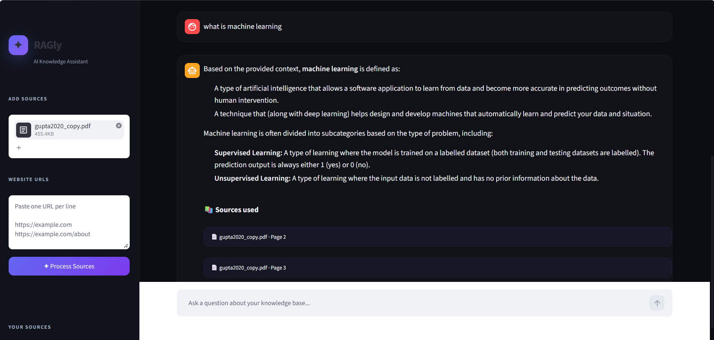

# ✦ RAGly — AI Knowledge Assistant

RAGly is a Retrieval-Augmented Generation (RAG) app that lets you upload PDFs and/or point to website URLs, then chat with the content. It retrieves the most relevant chunks from a vector database and uses Google's Gemini models to generate grounded, source-cited answers.

Built with **LangChain**, **ChromaDB**, **Google Generative AI (Gemini)**, and **Streamlit**.

## Screenshot



*Chat view: ask a question, get an answer generated only from your uploaded sources, with the exact source pages cited below.*

## Features

- 📄 **PDF ingestion** — upload one or more PDFs directly from the sidebar
- 🌐 **Website ingestion** — paste one or more URLs to pull in page content
- 🧠 **Grounded answers** — responses are generated only from retrieved context, with a clear fallback ("I could not find the answer in the provided sources") instead of hallucinating
- 🔍 **MMR retrieval** — uses Max Marginal Relevance search for diverse, relevant chunks
- 📚 **Source attribution** — every answer lists the documents/pages or URLs it drew from
- 💬 **Streaming chat UI** — a dark-themed, custom-styled Streamlit chat interface
- 🗂️ **Session knowledge base** — tracks number of sources and chunks processed per session

## Project structure

```
.
├── app.py             # Main Streamlit app (upload PDFs/URLs, chat UI, RAG pipeline)
├── main.py            # CLI script: query a pre-built Chroma DB from the terminal
├── create_chroma.py   # One-off script to build a persistent Chroma DB from a local PDF
└── .env               # API keys / model config (not committed)
```

- **`app.py`** is the main entry point — an interactive Streamlit app where you upload sources, they're chunked and embedded on the fly into an in-memory Chroma collection, and you chat against them.
- **`create_chroma.py`** builds a persistent Chroma database on disk (`./chroma_db`) from a local PDF, useful for a static, reusable knowledge base.
- **`main.py`** is a simple terminal script that loads that persistent Chroma DB and answers a single question from the command line.

## How it works

1. **Load** — PDFs are parsed with `PyPDFLoader`; websites are fetched with `WebBaseLoader`.
2. **Chunk** — content is split with `RecursiveCharacterTextSplitter` (1000 chars, 200 overlap).
3. **Embed** — chunks are embedded using a Gemini embedding model.
4. **Store** — embeddings are stored in a Chroma vector store.
5. **Retrieve** — user questions are matched against the store using MMR search (`k=4`, `fetch_k=10`).
6. **Generate** — retrieved chunks + the question are passed to a Gemini chat model, which is instructed to answer only from context and cite sources.

## Getting started

### Prerequisites

- Python 3.10+
- A [Google AI Studio](https://aistudio.google.com/) API key with access to Gemini chat and embedding models

### Installation

```bash
git clone https://github.com/DebosmitaBasu/RAG.git
cd RAG
python -m venv venv
source venv/bin/activate   # On Windows: venv\Scripts\activate
pip install streamlit langchain langchain-community langchain-google-genai langchain-chroma langchain-text-splitters python-dotenv pypdf
```

### Configuration

Create a `.env` file in the project root:

```env
GOOGLE_API_KEY=your_google_api_key_here
GEMINI_LLM_MODEL=gemini-2.0-flash
GEMINI_EMBEDDING_MODEL=models/embedding-001
```

> Model names are configurable — set them to whichever Gemini chat/embedding models your API key has access to.

### Run the Streamlit app

```bash
streamlit run app.py
```

Then, in the browser:
1. Upload one or more PDFs and/or paste website URLs in the sidebar.
2. Click **Process Sources** to build the knowledge base.
3. Ask questions in the chat box — answers stream in with a list of sources used.

### Run the CLI version

To use the terminal script instead, first build a persistent vector store from a local PDF:

```bash
python create_chroma.py
```

(Edit the file path inside `create_chroma.py` to point at your own PDF.)

Then query it:

```bash
python main.py
```

## Notes

- The Streamlit app builds an **in-memory** Chroma collection per session (no persistence between runs), while `create_chroma.py` / `main.py` use a **persistent** on-disk store (`./chroma_db`).
- `.env`, `myenv/`, and the `chroma_db*` folders are git-ignored — don't commit API keys or local vector store data.

## License

No license specified yet — add one (e.g. MIT) if you plan to share or open source this project.
